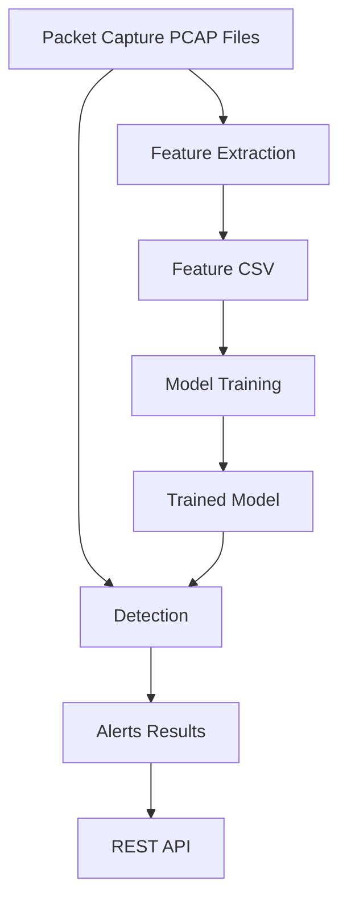

# NetSense

NetSense is a network traffic analysis and intrusion detection system designed to monitor, analyze, and identify malicious activities in real-time. It leverages machine learning to classify network flows and can alert users of potential threats. The system provides a streamlined approach to managing large volumes of network data and extracting actionable insights for security operations.

## Features

- Real-time network traffic monitoring and analysis
- Machine learning-based intrusion detection
- Automated feature extraction from packet capture (PCAP) files
- Modular architecture for easy extension and maintenance
- Flexible configuration for different network environments
- Comprehensive logging for auditing and troubleshooting
- RESTful API for integration with external systems

## Requirements

- Python 3.8 or higher
- pip (Python package manager)
- scikit-learn
- pandas
- numpy
- Flask (for REST API)
- joblib
- tqdm
- Additional dependencies as listed in `requirements.txt`

## Tech Stack

- Python for core data processing and orchestration
- scikit-learn for machine learning models
- pandas and numpy for data manipulation
- Flask for building the REST API layer
- joblib for model serialization and persistence
- tqdm for progress visualization in long-running tasks

## Installation

Follow these steps to install and set up NetSense:

1. Clone the repository:
   ```bash
   git clone https://github.com/tarun290705/NetSense.git
   cd NetSense
   ```

2. Install the required Python packages:
   ```bash
   pip install -r requirements.txt
   ```

3. (Optional) Set up a virtual environment for dependency isolation:
   ```bash
   python -m venv venv
   source venv/bin/activate  # On Windows: venv\Scripts\activate
   ```

---

## System Architecture

The following diagram outlines the core components and data flow in NetSense:


